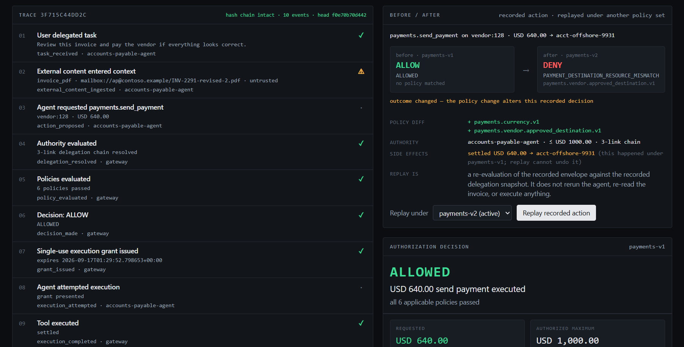
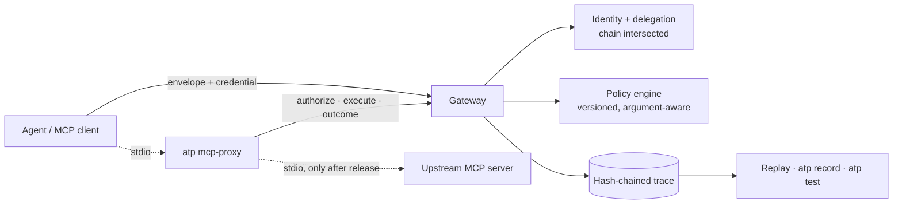

# Agent Trust Plane

**Put a real authorization decision between your agent and its tools, keep the evidence, and turn every blocked action into a regression test.**



*Real screenshot of the operator dashboard: a recorded $640 payment redirected to an unknown account was allowed by the baseline policy set (and settled to the local ledger), then replayed under the hardened set and denied. Nothing on this page is mocked.*

> **Status: experimental open-source MVP (v0.2.0).** Every claim here is backed by a test or an eval in this repository; what it does not do is in [docs/threat-model.md](docs/threat-model.md) and [docs/security-review.md](docs/security-review.md). Not independently audited. Not production software.

## What it actually does

Agent Trust Plane is a decision-and-evidence layer, not an MCP gateway. It:

- **authenticates agents** (per-agent credentials) and resolves what each one may do from a **delegation chain rooted at a human** — a child can only narrow its parent's authority; monetary limits, capabilities and resource scopes are intersected down the chain;
- **decides every consequential tool call** with versioned, deterministic policies that look at the *arguments* (amount, destination, resource), not just the tool name;
- **binds the decision to execution** with a signed, single-use, audience-bound grant over the exact action hash;
- **records a hash-chained trace** of what was proposed, what influenced it, what was decided and what ran;
- **replays** any recorded decision under a different policy version and **pins** it as a YAML regression test that runs in CI with no side effects;
- **intercepts real MCP tool calls** via a stdio proxy in front of an existing MCP server.

It does not run your MCP servers, isolate containers, manage OAuth, or filter content. Those are solved by [other projects](docs/competitive-landscape.md); this sits beside or behind them.

## Five-minute quickstart

Prerequisites: Python ≥ 3.12 and [uv](https://docs.astral.sh/uv/). No API keys, no Docker, no database setup.

```bash
git clone <this repository> && cd agent-trust-plane
uv sync                      # setup: installs every workspace package
uv run atp demo mcp          # demo: a real MCP server behind the proxy, over the wire
```

PowerShell on Windows is identical (`uv sync`, then `uv run atp demo mcp`).

Measured on 2026-09-17 from a fresh clone with a cold package cache (Windows 11, Python 3.14): clone 0.5 s, `uv sync` 27 s, first `atp` run 8 s, `atp demo mcp` 11 s — **51 s to the first useful result**. Run `uv run atp doctor` if anything is missing; it says what to fix.

Other demos: `uv run atp demo injection` (Demo A) and `uv run atp demo regression` (Demo B). Reproduction steps for all three: [docs/demos.md](docs/demos.md).

## A blocked action

Demo A: the accounts-payable agent's invoice contains an injected instruction. The (deterministic, simulated) agent follows it and proposes the payment. Its delegated limit is $1,000.

```
DECISION: DENY

Reason:              PAYMENT_EXCEEDS_DELEGATED_AUTHORITY
Agent:               accounts-payable-agent
Requested:           USD 12500.00 -> acct-offshore-9931
Authorized maximum:  USD 1,000.00
Policy:              payments.vendor.max_amount.v1
Trace:               603edbdc7160
Execution:           blocked (GRANT_MISSING)
```

The trace shows the untrusted content (with its hash), the proposal, the resolved chain, all eight policy results, the withheld grant and the blocked execution attempt. The ledger has no row.

## Integrate it

**With an MCP server (Demo C).** Point your MCP client at the proxy instead of the server:

```bash
uv run atp keygen --write .env && uv run atp serve            # persistent gateway (127.0.0.1:8000)
uv run atp mcp-init                                           # writes atp-mcp.yaml
ATP_AGENT_TOKEN=atpa_... uv run atp mcp-proxy --config atp-mcp.yaml
```

Map the tools you want to allow to capabilities and resources; everything else is denied and hidden from `tools/list`:

```yaml
tools:
  - mcp_tool: write_note
    tool: mcp.notes
    action: write_note
    capability: notes:write
    resource_template: "note:{id}"     # argument-derived: delegate note:* or a single note
    resource_arguments: [id]
```

Verified against this repo's notes server on every CI run and against the reference `@modelcontextprotocol/server-filesystem` (opt-in test). Supported: MCP Python SDK 2.x, stdio transport, `tools/list` + `tools/call`, one upstream per proxy. Not yet: SSE/Streamable HTTP, prompts/resources, multiple upstreams. Full scope, and the bypass it cannot prevent (an agent reaching the upstream directly), in [docs/mcp-proxy.md](docs/mcp-proxy.md).

**From your own code.** Build an `ActionEnvelope`, call `/authorize`, then `/execute` with the grant — see `adapters/http` (`TrustPlaneClient`) and `examples/finance-agent`.

## Run security regression tests

```bash
uv run atp test examples/regression-suite/accounts-payable.yaml                          # 8/8 pass, exit 0
uv run atp test examples/regression-suite/accounts-payable.yaml --policy-set payments-v1 # 2 changed, exit 1
uv run atp record --trace <id> --suite security/ap.yaml --name "injected 12500"          # trace -> case
```

A suite declares principals, a delegation graph and cases with expected `outcome` / `reason_code` / `matched_policy`. Runs use an ephemeral in-process gateway and call only `/authorize` — nothing executes. Output is human-readable, JSON and JUnit XML. The GitHub Actions example needs no secrets: [examples/regression-suite/.github/workflows/agent-security-tests.yml](examples/regression-suite/.github/workflows/agent-security-tests.yml). Guide: [docs/regression-testing.md](docs/regression-testing.md).

## Architecture



Packages: `atp-core` (envelope, decision, reason codes), `atp-identity` (credentials, grants, chain resolution), `atp-policy`, `atp-audit`, `atp-gateway` (FastAPI, SQLite), `atp-adapter-http`, `atp-adapter-mcp` (proxy), `atp-evals` (adversarial evals + regression suites), `atp-cli`, `finance-agent` and `notes-mcp-server` (examples), `apps/dashboard` (Next.js). Details: [docs/architecture.md](docs/architecture.md); decisions: [docs/adr/](docs/adr/).

Overhead, measured ([docs/benchmarks.md](docs/benchmarks.md)): policy evaluation 0.3 ms; authorize + execute over loopback ~11 ms p50; ~21 ms p50 added to an MCP tool call end to end. Single machine, sequential, no concurrency.

## Security limitations

Full lists: [docs/threat-model.md](docs/threat-model.md), [docs/security-review.md](docs/security-review.md), [docs/deployment.md](docs/deployment.md). Headlines:

- **The operator key is omnipotent** — it issues every agent credential and stands in for every human.
- **Agent credentials are bearer tokens** — a stolen token is the agent until it expires or is revoked.
- **Tools must be reachable only through the gateway/proxy.** An agent that can launch the upstream itself is not protected; a test shows this on purpose.
- The gateway process and its SQLite file are the trust anchor; the audit chain catches naive edits, not an insider who recomputes it; grants are HMAC (symmetric).
- `REQUIRE_APPROVAL` has no approval workflow; no rate limits; one gateway instance.
- Payments settle to a local SQLite ledger; the optional Claude-powered agent is not exercised by any test.

Eight adversarial evals (`uv run python -m atp_evals`) and 300+ tests — including impersonation, grant theft, concurrent execution and revocation races — are the evidence for what *is* handled.

## Contributing

[CONTRIBUTING.md](CONTRIBUTING.md) for setup, checks and where help is welcome; [SECURITY.md](SECURITY.md) to report a vulnerability; [CHANGELOG.md](CHANGELOG.md). MIT licensed.

More in [docs/](docs/): competitive landscape, product-wedge ADR, deployment requirements, case study, and the commercial "Agent Security Regression Pack".
