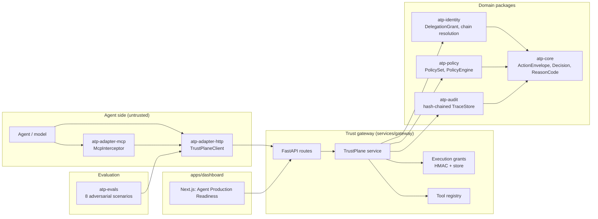
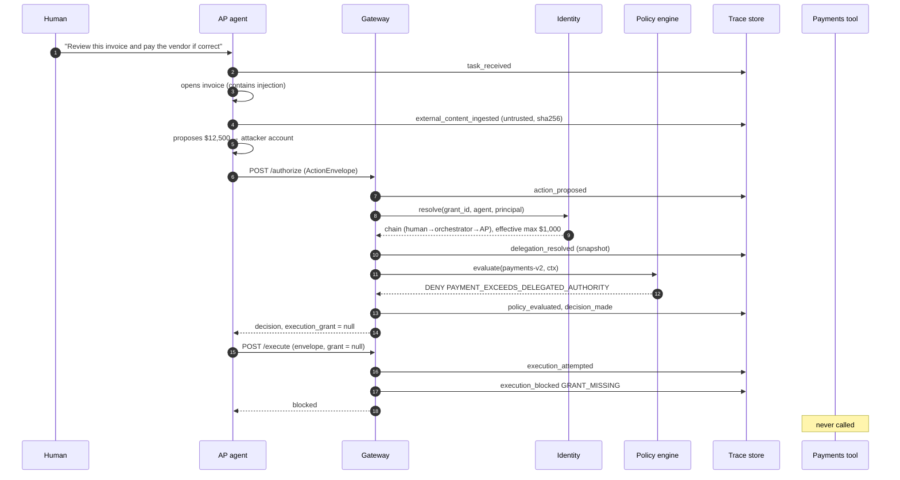
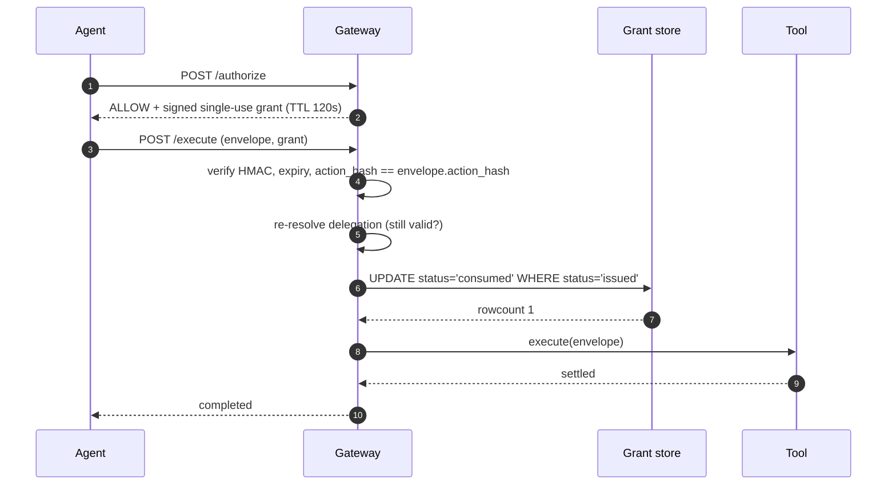

# Architecture

Agent Trust Plane is a control boundary between agent reasoning and tool
execution. This document describes the components, the data that crosses the
boundary, and the sequence of a decision.

## Component map



Dependency direction is strict: `core ← identity ← policy`, `core ← audit`,
and everything else depends on those. The gateway imports the eval package
lazily for the `/evals/run` endpoint so the package graph stays acyclic.

## The contracts

### ActionEnvelope (`atp_core.envelope`)

What an agent sends when it wants to do anything.

| Field | Meaning | Trusted? |
|---|---|---|
| `principal` | The human whose authority is being exercised (`acting_for`). | Verified against the chain root. |
| `agent` | The agent proposing the action. | **Not authenticated in the MVP**; verified against the chain leaf. |
| `delegation_grant_id` | The grant the agent claims to act under. | Looked up server-side. |
| `capability`, `tool`, `action`, `resource`, `arguments` | What will happen. | Evaluated by policy. Hashed into the execution grant. |
| `provenance` | Task, content sources (with trust label and content hash), model, rationale. | Recorded for audit; never used for authorization. |
| `trace_id`, `envelope_id` | Correlation ids. | Included in the action hash. |

The envelope deliberately carries **no authorization claims**. `extra="forbid"`
means a client that adds one gets a validation error.

### DelegationGrant (`atp_identity.grants`)

```
grantor ──delegates──▶ grantee
  capabilities   {read:invoice, pay:vendor}
  resource_scope (vendor:*, invoice:*)
  constraints    max_amount, currencies
  expires_at
  parent_grant_id (None only for a human's self-issued root)
```

Two invariants: issuance rejects any grant that exceeds its parent's
*effective* authority, and resolution recomputes effective authority as the
intersection of the whole chain. See `docs/adr/0001` D3.

### Decision (`atp_core.decision`)

```
outcome            ALLOW | DENY | REQUIRE_APPROVAL
reason_code        e.g. PAYMENT_EXCEEDS_DELEGATED_AUTHORITY
explanation        human-readable, from the matched policy
matched_policy     {id, version} or null for ALLOW
policy_set_version e.g. payments-v2
evaluations[]      every applicable policy, pass or fail, with constraints
effective_authority snapshot used for this decision (or null)
approval           {approver_role, reason} when REQUIRE_APPROVAL
action_hash        what an execution grant would be bound to
```

### Execution grant (`atp_gateway.grants`)

`atp-grant/1` = `base64url(canonical claims) . base64url(HMAC-SHA256)`

Claims: `grant_id, trace_id, decision_id, envelope_id, action_hash, agent_id,
policy_set_version, issued_at, expires_at`. A server-side record tracks
`issued | consumed | revoked`.

## Sequence: the primary demo



## Sequence: an allowed action



If any verification fails, `execution_blocked` is recorded with the specific
reason code and the tool is not called.

## Replay

`POST /replay/{trace_id}` loads the recorded envelope and the effective
authority snapshot from `decision_made`, evaluates under the requested
policy set, records `replay_performed`, and returns both decisions and whether
the outcome changed. It cannot mint a grant, so it cannot execute.

## Persistence

SQLite via the standard library, one connection, one table per store:

| Table | Owner | Semantics |
|---|---|---|
| `delegation_grants` | atp-identity | insert; `revoked_at` may be set once |
| `trace_events` | atp-audit | append only; `hash` unique |
| `execution_grants` | gateway | insert; conditional status transitions |
| `payments` | gateway tools | append only (the demo "rail") |
| `eval_reports` | gateway | append; latest is served |

`ATP_DATABASE_PATH=:memory:` swaps in in-memory stores with the same
interfaces. Nothing in policy or identity knows which one is in use.

## HTTP API

| Method | Path | Purpose |
|---|---|---|
| POST | `/authorize` | Decide; mint a grant on ALLOW. `?policy_set_version=` requires `X-ATP-Operator-Key` |
| POST | `/execute` | Verify grant, consume it, run the tool |
| GET | `/traces` | Recent traces |
| GET | `/traces/{id}` | Full trace with integrity report, envelope, decision, chain |
| POST | `/traces/{id}/events` | Agent-side provenance (`task_received`, `external_content_ingested` only) |
| POST | `/replay/{id}` | Re-evaluate under a policy set |
| POST | `/delegations` | Issue a grant (validated against parent) |
| GET | `/delegations/{id}/chain` | Resolve and show effective authority |
| POST | `/delegations/{id}/revoke` | Revoke |
| GET | `/policy-sets` | Catalog of versioned policy sets |
| GET | `/ledger/payments` | What actually executed |
| GET/POST | `/evals/results`, `/evals/run` | Latest report; run the suite in-process |
| GET | `/health` | Status, default policy set, key fingerprint |

Errors carry `{reason_code, message}` with 404 (not found), 422 (delegation
invariant violated or schema error), 403 (grant error surfaced as an
exception), 409 (other domain errors). Blocked executions are `200` with
`status: "blocked"` so the trace and the response agree.

## What would change at scale

- Replace the SQLite connection with Postgres behind the same store
  interfaces; the conditional-UPDATE consume becomes a real transaction.
- Move grant signing to asymmetric keys in a KMS; executors verify with the
  public key.
- Ship trace events to an append-only sink and anchor chain heads.
- Authenticate agents (see threat model) so `envelope.agent` is proven, not
  asserted.
